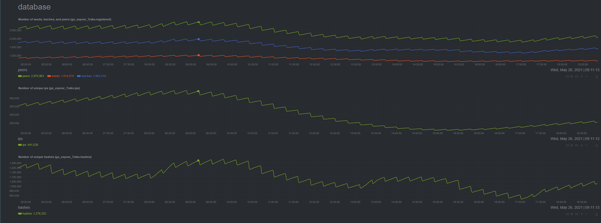

# Trakx

Performance focused HTTP & UDP BitTorrent tracker.

## Instances

Try me! These instances are hosted on Oracles always free tier.

| Status      | Protocol | URL                               |
|-------------|----------|-----------------------------------|
| ✅Ok         | UDP      | udp://u4.trakx.crim.ist:1337/     |
| ❌Deprecated | HTTP     | http://h4.trakx.crim.ist/announce |

## Install

Go 1.16+ required.

```sh
git clone https://github.com/crimist/trakx && cd trakx

# install to go bin
go install .
trakx status # generates configuration

# or build
go build .
./trakx status # generates configuration
```

See [configuration](#configuration) and [netdata setup](#netdata-setup).

## Configuration

### Modifying the config

The config can be found at `~/.config/trakx/trakx.yaml`.
You'll have to run the trakx controller at least once to generate this file.

Config settings can be overwritten with environment variables:

```sh
$ cat trakx.yaml
...
loglevel = error
...

$ TRAKX_LOGLEVEL=DEBUG trakx run
2022-01-16T19:52:25.627-0800    DEBUG   Debug level enabled, debug panics are on
...
```

Trakx attempts to load the config file from the following directories in this order `".", "~/.config/trakx/"`.

For example, you can override the config file located in `~/.config/trakx/` by placing a `trakx.yaml` in the directory trakx runs in (`./`).

### Modifying default config & HTML pages

You can modify the default config and pages served by the HTML server by editing/adding them in the `tracker/config/embeded/` folder.

**WARNING:** Due to the performance focused implementation trakx will only serve files at their full path. Example: `dmca` will 404, `dmca.html` will 200.

### Binding to privileged ports

To bind to privileged ports I recommend using the `CAP_NET_BIND_SERVICE` capability. More information about this can be found [here](https://stackoverflow.com/a/414258/6389542).

```
$ sudo setcap 'cap_net_bind_service=+ep' ./trakx
$ TRAKX_TRACKER_HTTP_PORT=80 ./trakx run
2022-04-05T16:18:05.847-0700    INFO    HTTP tracker enabled    {"port": 80}
```

### Build Tags

You can build with different tags with `go build/install -tags <tag> .`

**Tags**
* `fast` will build without IP, seed, and leech metrics which will reduce cpu and memory usage
* `heroku` will build trakx for app engines. This means the controller will not be built and trakx will run immediately when the binary is executed. 

## Performance

The following performance information was collected on Heroku free tier running an HTTP tracker with the `fast` tag disabled.
### Heroku dashboard


### Database stats



### Flamegraph


#### **CPU**

Trakx has been optimized to use a little CPU time as possible. In most cases, almost all CPU time will be spent handing (negotiating/send/recv) connections, especially for TCP.

In this example the databases write (save peer information) function took 0.3% of total cpu time.

#### **Memory**

Again, trakx has been optimized for a minimal memory footprint and is mostly limited by the go GC.

In this example the GC runs every 2 minutes ([the forced GC period](https://github.com/golang/go/blob/895b7c85addfffe19b66d8ca71c31799d6e55990/src/runtime/proc.go#L4481-L4486)) at this level of traffic. The `inuse_space` delta from GC is 7.5% meaning this collection frequency would be sustained at `GOGC=8`.

## Netdata setup

**Warning:** the `install.sh` script will overwrite `go_expvar.conf`. If you are using other expvar programs with netdata you can manually merge the two files.

* Run `/etc/netdata/edit-config python.d.conf`, change `go_expvar` to `yes`.
* Customize the url in `netdata/expvar.conf` if needed.
* Install netdata plugins with `cd netdata; ./install.sh`.

## Notes

* If you're going to be serving a lot of clients on a non managed service it's recommended to perform [sysctl tuning](https://web.archive.org/web/20200706222821/https://wiki.mikejung.biz/Sysctl_tweaks). This is especially important if you're running a TCP tracker
* Trakx uses `unsafe` to read raw memory when backing up the database. This means that database saves could *technically* break between go versions if struct padding or internal slice structures are changed. This will likely never happen but if you wish to be safe you can change the encoding method to `encodeBinary()` to avoid this issue. This fix comes with a performance penalty. Backing up will take 3x more memory and be 7x slower.

