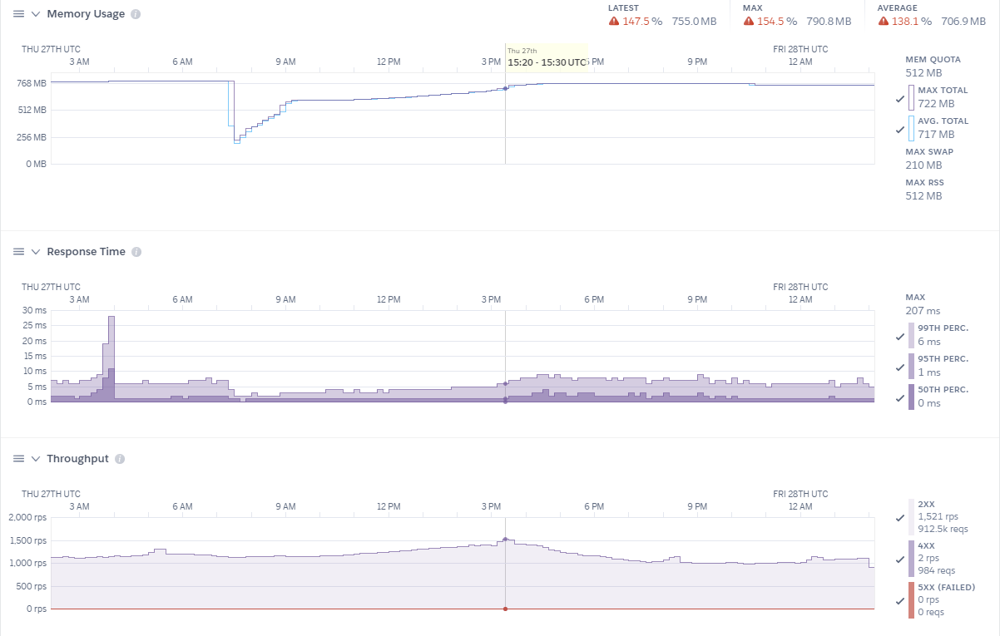

# trakx [](https://godoc.org/github.com/crimist/trakx) [](https://goreportcard.com/report/github.com/crimist/trakx)

Fast bittorrent tracker

## Performance

Here's an HTTP tracker running on heroku free tier with the `fast` tag disabled.




As demonstrated by the flame graph almost all of the CPU usage is from handling the TCP connections. Here the databases save function made only 0.3% of the flame graph cpu time.

Memory wise the go GC only runs every 2 min ([the maximum GC period](https://github.com/golang/go/blob/895b7c85addfffe19b66d8ca71c31799d6e55990/src/runtime/proc.go#L4481-L4486)) at this level of traffic. The `inuse_space` delta between right after vs right before GC is 7.5%, basically this collection frequency would be sustained at `GOGC=8`.

## Install

go 1.13+ recommended for `sync.Pool` and `sync.RMutex` optimizations.

```sh
git clone github.com/crimist/trakx
cd trakx/install
./install.sh
trakx status # "Trakx is not running"
```

### Netdata install

**Note:** If you have other go program using expvar with netdata you'll have to manually add the trakx config, `install.sh` will overwrite `go_expvar.conf`.

* Open netdata python conf with `/etc/netdata/edit-config python.d.conf` and change `go_expvar` to `yes`
* Customize the url in `expvar.conf` if needed
* Install netdata plugins with `sh netdata/install.sh`

## Updating

* Running `./install/install.sh` will update and ask if you want to keep your config

## Build tags

* `fast` tag will build without IP, seeds, and leeches metrics which will speed up trakx
* `heroku` tag will build the service for app engines, this means that when executed the binary will immediately run the tracker

## Notes

* If you're going to be serving a lot of clients on a non managed service take a look at [sysctl tuning](https://wiki.mikejung.biz/Sysctl_tweaks). This is especially important if you're running a TCP tracker
* There's no *guarantee* that database saves work between go versions - by default I use `unsafe` to read raw memory so if they change `struct` padding or completely change byte slices it could break your save between versions. You can change the encoding method to `encodeBinary()` to avoid this issue but it takes 3x more memory and is 7x slower. Also the chance this breaks between versions is *insanely low*.
